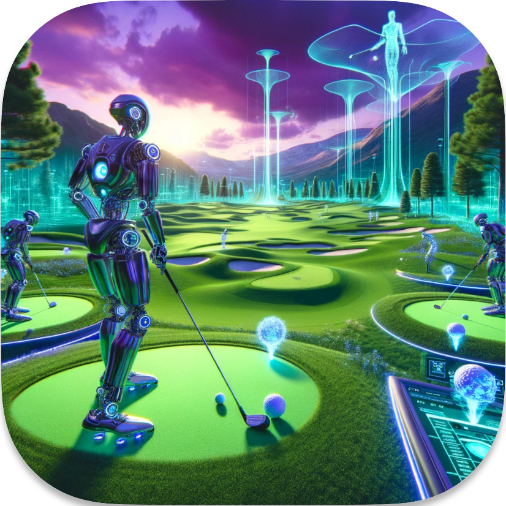

<div align="center">
  
  
  # Pot Pot Golf

  [](https://www.oracle.com/java/)
  [](https://www.lwjgl.org/)
  [](https://maven.apache.org/)
  [](https://opensource.org/licenses/MIT)

  A physics-based golfing game built with Java and LWJGL, featuring realistic ball dynamics, AI opponents, and customizable terrain.
</div>

---

## 🎮 Overview

Pot Pot Golf is a physics-driven golf simulation where players strategically control the initial velocity of the ball to navigate challenging courses with the fewest shots possible. The game features realistic physics, variable terrain properties, and intelligent AI opponents.

<details open>
<summary><b>Key Features</b></summary>

- **Realistic Physics Engine**: Ball movement follows accurate physics principles, including friction, gravity, and collision
- **AI Opponents**: Two different bot implementation strategies to compete against
- **Procedurally Generated Terrain**: Randomly generated courses with varying terrain types
- **Multiplayer Mode**: Compete against friends in local multiplayer
- **Debug Mode**: Fully customizable environment for testing and experimentation
- **Directional Guidance**: Visual indicators help players aim their shots
- **Rich Visual Environment**: 3D terrain with trees, water hazards, and sand traps

</details>

## 🚀 Getting Started

### Prerequisites

- Java 22 or higher
- Maven (for building and running)

### Installation

1. **Clone the repository**
   ```bash
   git clone https://github.com/yourusername/pot-pot-golf.git
   cd pot-pot-golf
   ```

2. **Build the project**
   ```bash
   mvn clean package
   ```
   This will create a target directory with the JAR file and compile all classes.

3. **Generate JavaDoc** (optional)
   ```bash
   mvn javadoc:javadoc
   ```
   The documentation will be available in `target/site/apidocs/index.html`.

### Running the Game

**Option 1: Using Maven**
```bash
mvn exec:exec
```

**Option 2: Running the Launcher directly**
- Run the Launcher class in the game directory
- Mac users: Add `-XstartOnFirstThread` as a JVM argument

> **Note for Mac Users**: When running directly from an IDE, add `-XstartOnFirstThread` to your run configuration.

## 🎯 Gameplay

### Game Objective
The goal is simple: get the ball into the hole with the fewest shots possible, navigating around obstacles and challenging terrain.

### Ball Movement
- Input the initial velocity vector (vx, vz) in the provided text field
- The vertical component is automatically calculated based on the terrain
- Negative values make the ball go backward
- A directional arrow helps visualize the shot direction
- Press "Apply" to execute the shot

### Game Modes

<details>
<summary><b>Single Player</b></summary>

- Navigate through the course on your own
- Track your score and try to beat your personal best
- Practice your shots and strategies

</details>

<details>
<summary><b>Multiplayer</b></summary>

- Two players take turns on the same course
- The player who completes the hole with fewer shots wins
- Players alternate turns until both complete the hole
- Even after completion, players can continue exploring the map

</details>

<details>
<summary><b>Bot Mode</b></summary>

- Two different AI implementations:
  - **AI Bot**: Advanced pathfinding algorithm (press 1 to watch it take a shot)
  - **Rule-Based Bot**: Simpler rule-following algorithm (press 2 to watch it take a shot)
- Bots calculate their entire path before starting
- Watch and learn from their strategies

</details>

<details>
<summary><b>Debug Mode</b></summary>

- Fully customizable environment
- Define start and hole positions
- Adjust terrain parameters
- Place trees manually
- Test different physics settings

</details>

## 🎛️ Controls

### Camera Navigation
- **WASD**: Move camera horizontally
- **Space/Shift**: Move camera up/down
- **Right Mouse Button + Drag**: Rotate camera

### Game Controls
- **Q**: Teleport to the ball
- **↓ (Down Arrow)**: Teleport to the hole
- **↑ (Up Arrow)**: Teleport to start position
- **R**: Reset all balls (only when no balls are moving)
- **F**: Surprise feature
- **Esc**: Open in-game menu

### Bot Controls
- **1**: Watch AI bot take a shot
- **2**: Watch Rule-Based bot take a shot

### Debug Mode Controls
- **← (Left Arrow)**: Set start position
- **→ (Right Arrow)**: Set hole position
- **T**: Place a tree at current camera position

## ⚙️ Customization

The game offers extensive customization through the `Consts` class:

<details>
<summary><b>Terrain Settings</b></summary>

- Terrain size and height
- Simplex noise parameters
- Texture quality (vertex count)
- Number of trees
- Predefined start/hole positions

</details>

<details>
<summary><b>Physics Settings</b></summary>

- Gravity
- Ball mass
- Maximum ball speed
- Friction coefficients (static and kinetic)
- Separate friction values for grass and sand

</details>

<details>
<summary><b>Visual Settings</b></summary>

- Frame rate
- Field of view (FOV)
- Near and far plane
- Specular power
- Ambient light
- Default color

</details>

<details>
<summary><b>Bot Settings</b></summary>

- Error margin
- Sensitivity (step size)
- Target radius

</details>

## 📋 Known Issues

- Ball movement occasionally pauses mid-shot but resumes after a moment
- Ball slides excessively on grass, especially on simple terrain (consider increasing friction in `Consts` class)
- AI bots may struggle to reach holes positioned on hills (future updates will improve height-based decision making)

## 📚 Technical Documentation

- **UML Diagram**: Available as `ProjectDiagram.png` in the main directory
- **JavaDoc**: Generate with `mvn javadoc:javadoc` and view in `target/site/apidocs/index.html`

## ⚠️ Disclaimer

- Keyboard bindings are mapped for QWERTY layouts; special characters may differ on other layouts
- The game is not optimized for low-end computers

## 🙏 Credits & Licenses

- **Initial Setup**: Guided by DevGenie Academy tutorial for LWJGL understanding
- **Terrain Textures**: Created by upklyak ([Freepik License](https://www.freepik.com/free-vector/game-textures-water-green-lawn-sand-grass-meadow-with-flowers-seamless-patterns-top-view-cartoon-textured-backgrounds-blue-liquid-field-desert-surface-graphic-ui-gui-vector-layers_21267469.htm))
- **UI Buttons**: Created by Yuliya Pauliukevich ([Vecteezy License](https://www.vecteezy.com/vector-art/13133856-web-and-game-menu-buttons-with-different-textures))
- **Directional Arrows**: Created by Marcel Plagmann ([cgTrader License](https://www.cgtrader.com/free-3d-models/various/various-models/cc0-arrow-5))
- **Tree Models**: Created by printable_models ([Free3D License](https://free3d.com/3d-model/-oak-tree-v1--463277.html))
- **Skybox**: Created by KIIRA ([OpenGameArt License](https://opengameart.org/content/sky-box-sunny-day))
- **Font**: Mighty Souly by graphicsauceco ([FontSpace License](https://www.fontspace.com/mighty-souly-font-f111822))
- **Background Music**: Created by Fernweh Goldfish ([UppBeat License](https://uppbeat.io/t/fernweh-goldfish/skippy-mr-sunshine))

## 👥 Authors

- Noam Favier
- Ole Rotteveel
- Beatrice Boccolari
- Bruna Calvancati Lauro
- Evi Levels
- Ahmet Akman
- Nehir Sarihan
